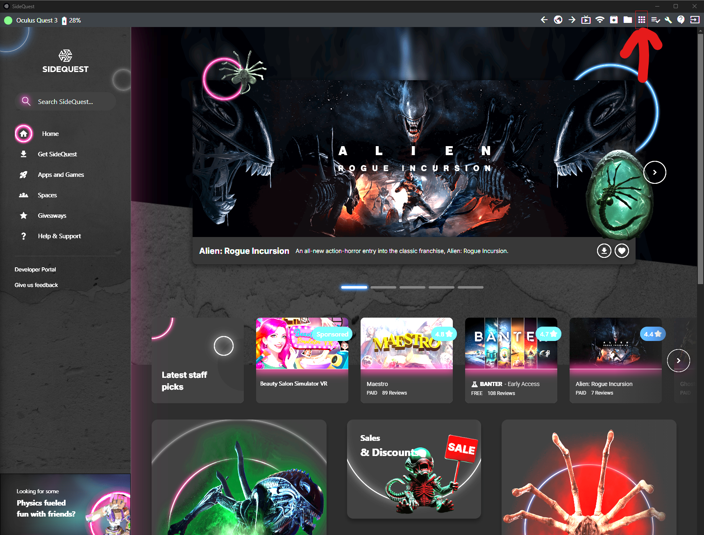
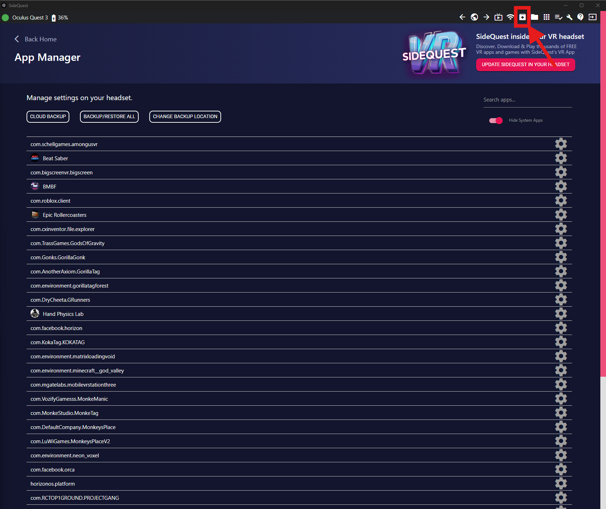

# How To: Installing Gorilla Tag via Sidequest  
*The Ultimate Modding Adventure (Because Who Needs Boring When You Can Go Bananas?)*

Welcome, fearless modders and mischief-makers! Ready to swap out your vanilla Gorilla Tag for a modded masterpiece that’ll have your Oculus Quest swinging like King Kong on a sugar rush? Follow these delightfully absurd steps—and keep your skepticism handy (because even the best mods sometimes act like a mischievous monkey).

---

## 1. Install Sidequest

1. **Download Sidequest**  
   Scamper over to the [Sidequest website](https://sidequestvr.com/) and grab the advanced installer for your OS (Windows, macOS, or Linux).  
     
   *(Because who doesn’t love downloading new apps like a squirrel hoarding nuts?)*

2. **Install Sidequest**  
   Run the installer and follow the on-screen instructions. Yes, you *really* need another app on your computer—but think of it as an adventure accessory!

3. **Launch Sidequest**  
   Open Sidequest once installation is complete. Welcome to your new portal to modding mayhem!

---

## 2. Prepare Your Oculus Quest

1. **Enable Developer Mode**  
   - Open the Oculus mobile app on your smartphone.  
   - Go to **Settings** and select your Oculus Quest.  
   - Tap **More Settings** and toggle **Developer Mode** on.  
     *(Don’t skip this step unless you want your Quest to throw a tantrum like a toddler denied candy.)*

2. **Connect Your Device**  
   Plug in your Oculus Quest to your computer with a USB cable. Accept any prompts on your headset to enable USB debugging (yes, even if you feel like you’re being pestered by yet another pop-up).

---

## 3. Uninstall the Existing Gorilla Tag

**Using Sidequest:**  
- In Sidequest, navigate to the list of installed apps (go ahead, put your headset down for a sec—no judgment here).  
  
- You should see a list that looks something like this:  
  
- Locate **"com.AnotherAxiom.GorillaTag"**  
  
- Click the settings icon next to it and hit uninstall.  
  **Note:** This uninstallation process **won’t remove any cosmetics**—so your avatar still gets to look fabulous.

---

## 4. Install the Modded Gorilla Tag APK

1. **Download the APK**  
   Make sure you’ve downloaded the modded Gorilla Tag APK on your computer. (Double-check the version—you don’t want to end up with a mod that makes gorillas dance ballet, unless that’s your thing.)

2. **Install via Sidequest**  
   - In Sidequest, click the **"Install APK file from folder"** button (the one that looks like a box with an arrow—if it doesn’t, it’s probably trying to hide from you).  
     
   - Navigate to and select your modded APK file.

3. **Monitor the Installation**  
   Sit back, relax, and wait for that glorious success message from Sidequest confirming your mod is installed. (If not, well… the mod might be playing hide-and-seek again.)

---

## 5. Launch Gorilla Tag

1. **Disconnect Your Device**  
   Unplug your Oculus Quest from your computer. Freedom at last—go celebrate with a banana!

2. **Start the App**  
   - On your Quest, find Gorilla Tag in your library and launch it.  
   - **Heads Up:** If a popup appears saying the app has been modified, click **Open App**. Embrace the change like it’s your new best friend!

---

## Troubleshooting

- **Device Not Detected?**  
  Double-check that Developer Mode is enabled and your USB cable isn’t on a coffee break.
- **Installation Errors?**  
  Verify that your APK file is the correct version. If things go haywire, try reinstalling—because sometimes mods need a second chance. 
- **Other Issues?**  
  When all else fails, restart both your Oculus Quest and computer. Then, channel your inner zen and try again.
- **More Help?**
 - If all else fails report an issue on github.
 
For more details on Sidequest and troubleshooting wizardry, check out the official [Sidequest Documentation](https://docs.sidequestvr.com/).

---

*If more mischief-makers report errors, I promise to update this guide with fixes. Until then, happy modding—and may your Quest swing smoother than a caffeinated chimp!*
